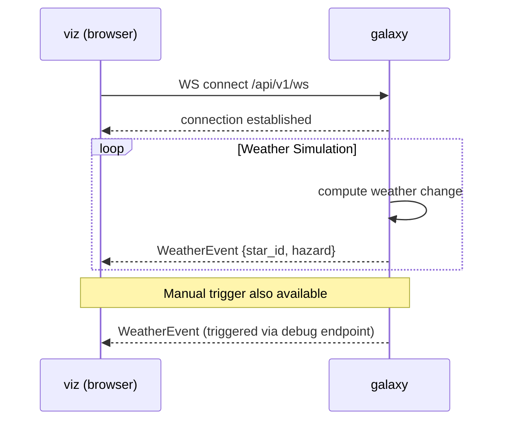
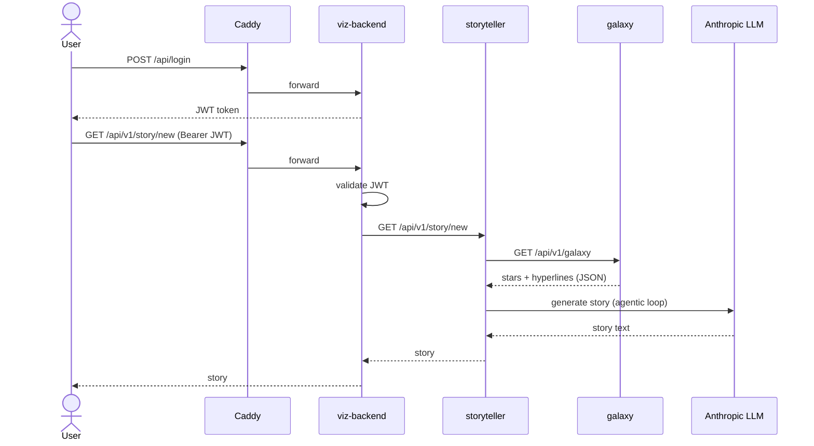

# Star-y

A polyglot (**Rust**, **Go**, **Python**, **TypeScript**) microservices proof-of-concept that renders an interactive galaxy, streams live weather events over *WebSocket*, and uses an Anthropic LLM agent to generate themed stories about the galaxy - all served behind a single **Caddy** reverse proxy.

## Disclaimer
Development efforts were concentrated on achieving functionality, which led to certain shortcuts in the development process that require attention (tech-debt).

## Todo
1. **Observability** - Add observability layer with *Prometheus* for metrics collection, *Grafana* for visualization. Add standard health check endpoints to each microservice.
2. **User management** - Replace hardcoded admin credentials with a secure authentication and authorization system.
3. **API specification** - Implement OpenAPI to document all APIs centrally enabling automated API documentation.
4. **Resilience** - Currently there is no rate-limiting on concurrency-limiting implemented.

## Components

### `proto` - Shared Data Model
- **Language:** Protobuf  
- **Role:** Single source of truth for all data structures shared across services. Any service that exchanges structured data references these definitions, ensuring consistency.

### `caddy` - Reverse Proxy
- **Role:** Runs a Caddy HTTP server in Docker, acting as the single entry point for all traffic on `localhost`. Routes `/api/*` requests to the `viz-backend`, and serves the `viz` frontend for all other paths.

### `galaxy` - Galaxy State Service
- **Language:** Go  
- **Server:** Gin  
- **Role:** Owns and maintains the state of the Galaxy - the playfield consisting of stars and hyperlines (connections between stars). Also drives a live weather simulation, broadcasting hazard events to connected clients over **WebSocket**.

The `galaxy` service continuously simulates star weather and pushes hazard events to all connected WebSocket clients in real time.



### `storyteller` - LLM Story Generator
- **Language:** Python  
- **Server:** FastAPI  
- **Role:** Orchestrates an agentic loop against the **Anthropic API** to generate a narrative story for the current galaxy. It first fetches the galaxy's shape from the `galaxy` service, then runs an LLM conversation that supports **tool use** (e.g., fetching the story theme).



### `viz` - Frontend
- **Language:** TypeScript  
- **Role:** Browser-based visualization app. Renders the galaxy (stars, hyperlines), displays live weather events received over WebSocket, and lets users login to request stories.

### `viz-backend` - Backend for `viz`
- **Language:** Rust  
- **Server:** axum  
- **Role:** Backend that sits between the frontend and the internal services. Handles user authentication (JWT generation and validation). On authenticated story requests, it delegates to `storyteller` and proxies the result back to the client.

### Anthropic LLM *(External)*
- **Role:** External AI model used by `storyteller` to generate galaxy narratives. Invoked via the Anthropic API within an agentic loop that supports tool calls.

## API Reference

### `galaxy` (Go / Gin)

| Method | Path | Description |
|--------|------|-------------|
| `GET` | `/api/v1/galaxy` | Returns stars and hyperlines (binary proto) |
| `WS` | `/api/v1/ws` | WebSocket stream of weather events |
| `GET` | `/api/v1/debug/triggerWeatherChange` | Manually trigger a weather change event |

### `storyteller` (Python / FastAPI)

| Method | Path | Description |
|--------|------|-------------|
| `GET` | `/api/v1/prompt` | Returns the LLM system prompt |
| `GET` | `/api/v1/story/new` | Triggers story generation via LLM agentic loop |
| `GET` | `/api/v1/theme` | Returns the current story theme (used as LLM tool) |

### `viz-backend` (Rust / axum)

| Method | Path | Description |
|--------|------|-------------|
| `POST` | `/api/login` | Authenticates user and returns a JWT |
| `GET` | `/api/v1/story/new` | Validates JWT, proxies story request to `storyteller` |

## Auxiliary notes
### Ports

`viz` - 8080

`galaxy` - 8081

`pathfinder` - 8082

`storyteller` - 8083

`viz-backend` - 8084

### Tools

#### TypeScript
```
npm install --save-dev ts-proto
```

#### Python
```
pip install uvicorn
pip install fastapi
pip install httpx
```

#### Other dependencies
```
apt-get install libnss3-tools
```

### Curl
```
curl -i -X POST http://localhost:8084/login   -H "Content-Type: application/json"   -d '{"username":"admin","password":"*****"}
```

```
curl -i -X GET http://localhost:8084/api/v1/story/new   -H "Authorization: Bearer XXX.YYY.ZZZ"
```

Connect to Weather websocket in Galaxy service:
```
websocat ws://localhost:8081/api/v1/ws
```

Trigger debug weather change event:
```
curl http://localhost:8081/api/v1/debug/triggerWeatherChange
```

